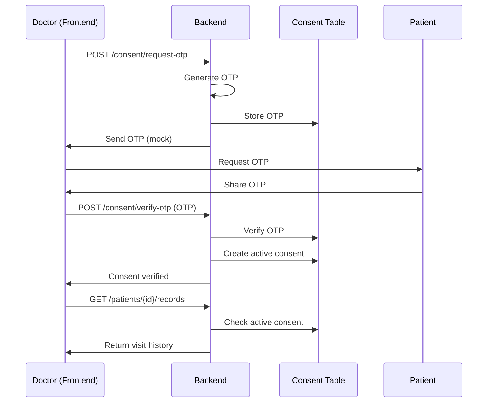
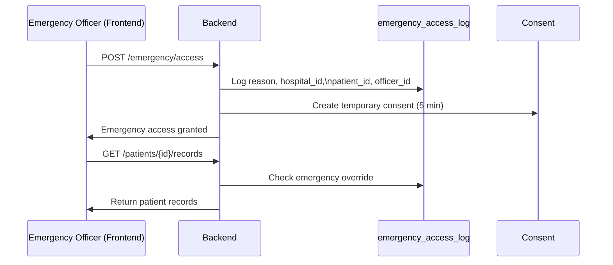

# INHMP (Integrated National Health Mangement Platform)

***"Centralized. Intelligent. Connected Healthcare."***

## Data Flow Diagrams

### Normal Consent-Based Access
```mermaid
flowchart TD

    Doctor[Doctor]
    Patient[Patient]

    P1[Request OTP]
    P2[Verify OTP]
    P3[Fetch Patient Records]

    D1[(Consent Table)]
    D2[(Patient Records DB)]

    Doctor -->|POST /consent/request-otp| P1
    P1 -->|Generate & Store OTP| D1
    P1 -->|Send OTP (mock)| Doctor

    Doctor -->|Submit OTP| P2
    P2 -->|Verify OTP| D1
    P2 -->|Create Active Consent| D1

    Doctor -->|GET /patients/{id}/records| P3
    P3 -->|Check Active Consent| D1
    P3 -->|Fetch Records| D2
    P3 -->|Return Visit History| Doctor
```

### Emergency Access Override
```mermaid
flowchart TD

    Officer[Emergency Officer]

    P1[Emergency Access Request]
    P2[Fetch Patient Records]

    D1[(Emergency Access Log)]
    D2[(Temporary Consent)]
    D3[(Patient Records DB)]

    Officer -->|POST /emergency/access| P1
    P1 -->|Log reason, hospital_id,\npatient_id, officer_id| D1
    P1 -->|Create 5-min Temporary Consent| D2
    P1 -->|Access Granted| Officer

    Officer -->|GET /patients/{id}/records| P2
    P2 -->|Check Emergency Override| D1
    P2 -->|Validate Temporary Consent| D2
    P2 -->|Fetch Records| D3
    P2 -->|Return Records| Officer
```

## Sequence Diagrams

### Normal Consent-Based Access



### Emergency Override (Break‑Glass)



